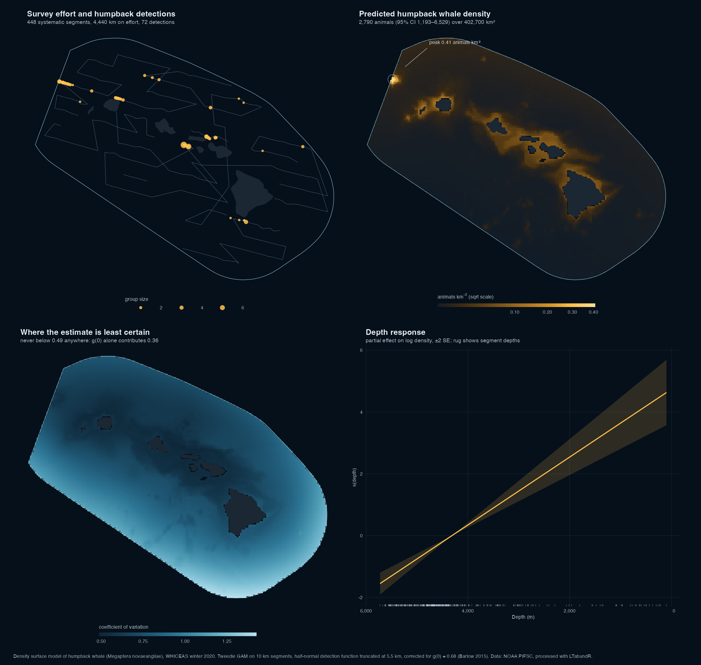

```{r setup}
#| code-summary: "Setup"
library(dplyr); library(here); library(knitr)
P  <- readRDS(here("data", "derived", "dsm_prediction.rds"))
DF <- readRDS(here("data", "derived", "df_humpback.rds"))

det   <- DF$obs |> filter(distance <= DF$truncation)
n_seg <- nrow(P$segments)
eff   <- sum(P$segments$Effort)
water <- nrow(P$grid) * P$cell^2
fmt   <- function(x, d = 0) format(round(x, d), big.mark = ",")
```

The [seasonal map](cetacean-seasonal-map.html) shows where cetaceans were recorded in the Hawaiian
Islands EEZ across the seasons. It stops there deliberately: the public sighting
archive records *what was seen*, not *where anyone looked*, and without effort
there is no denominator and no abundance.

This page takes the next step using a different source — the line-transect data
PIFSC collects and distributes with its own analysis software — and builds a
density surface model for humpback whales from the winter 2020 survey. The
estimate is then checked against PIFSC's published one for the same survey.

## Why the archive could not do this

A density surface model needs three things the sightings archive does not carry:

**Effort.** Density is animals per unit area, and the area is the strip the
observers actually watched. Without trackline positions and distances there is no
denominator.

**Perpendicular distances.** Detection probability falls with distance from the
trackline, and the detection function that describes that fall is estimated from
the distances themselves. No distances, no detection function, no correction for
the animals that were missed.

**Effort-linked structure.** A DSM is a regression whose rows are pieces of
trackline. Sightings alone give no rows.

## The data

`r fmt(n_seg)` segments of systematic on-effort trackline, `r fmt(eff)` km,
inside the WHICEAS study area during the winter 2020 survey, carrying
`r nrow(det)` humpback whale detections and `r fmt(sum(det$size), 1)` animals.

These come from the DAS files distributed with
[LTabundR](https://github.com/PIFSC-Protected-Species-Division/LTabundR), the
Protected Species Division's own R package for line-transect abundance, and its
[vignette repository](https://github.com/PIFSC-Protected-Species-Division/LTabundR-vignette).
Using PIFSC's software on PIFSC's data means the processing decisions here are
theirs, not mine — with one deliberate exception, below.

```{r segments}
#| code-summary: "Reprocessing the DAS files into 10 km segments"
#| eval: false
set <- cruz_1720$settings
set$survey$segment_target_km <- 10        # was 150
cruz10 <- process_surveys(das, settings = set)
```

That one line is the exception. LTabundR segments effort into ~150 km blocks
because, for design-based abundance, the segment is the bootstrap resampling
unit and long segments are what you want. In a density surface model segments
are the *rows of the regression*, and a spatial smooth learns very little from a
hundred rows averaging 100 km each. Everything else — the strata, the species
codes, the group-size calibration, the effort classification — is PIFSC's
settings object unchanged, so the difference between this processing and the
published processing is exactly one parameter.

### Choosing a species

```{r species}
#| code-summary: "Detections by species"
#| eval: false
sit |> filter(OnEffort, EffType == "S", included) |> count(year, species)
```

A detection function conventionally needs 60–80 detections. Across both surveys
in the vignette data, only humpback whales in winter 2020 reach that — nothing
in the 2017 summer survey comes within a factor of seven. That settles the
species and rules out the seasonal comparison this would otherwise invite.

## Detection function

Following Bradford, Yano & Oleson (2022), truncation is 5.5 km and Beaufort sea
state is the candidate covariate. Half-normal and hazard-rate keys were fitted
with and without it, adjustment terms switched off throughout so the comparison
is fair.

```{r df-table}
#| code-summary: "Model comparison"
DF$comparison |>
  rename(`ΔAIC` = delta_aic, `ESW (km)` = esw, `p` = p, `CvM p` = cvm_p) |>
  kable(digits = 3)
```

Two things worth stating plainly.

**Beaufort did not earn its place.** Adding it to the half-normal costs
`r round(DF$comparison$delta_aic[DF$comparison$model == "hn ~Bft"], 2)` AIC —
almost exactly the penalty for a parameter that contributes nothing. This
differs from Bradford et al., who did retain it, but they fitted on a pooled
dataset far larger than 72 detections and had the power to resolve an effect
this one cannot. Beaufort ran from 2 to 6 here with real spread, so this is a
sample-size limitation rather than a survey that was too uniform to tell. It
makes no practical difference: mean effective strip width is
`r DF$comparison$esw[DF$comparison$model == "hn ~1"]` km without the covariate
and `r DF$comparison$esw[DF$comparison$model == "hn ~Bft"]` km with it.

**Effective strip width lands at
`r round(DF$comparison$esw[DF$comparison$model == "hn ~1"], 2)` km against their
3.72 km.** Around `r round(100 * (DF$comparison$esw[DF$comparison$model == "hn ~1"] / 3.72 - 1))`%
high, which would push density about as much low. But the four candidates here
span `r round(min(DF$comparison$esw), 2)` to `r round(max(DF$comparison$esw), 2)` km
and their figure sits inside that range — this is the
choice of key function, not a disagreement about the data. The hazard-rate fits
warn that the scale parameter is collapsing toward zero, a consequence of a
notably flat detection histogram rather than a spike at the trackline, so the
half-normal is the one to trust despite its respectable goodness-of-fit
competitor.

A separate check supports the data assembly: mean group size is
`r round(mean(det$size), 2)` here against 2.3 in the published analysis. That falls out of the filtering rather
than being tuned toward.

## The density surface model

```{r gam-table}
#| code-summary: "Candidate models"
P$comparison |>
  rename(`ΔAIC` = delta_aic, `deviance explained (%)` = dev_expl, `EDF` = edf) |>
  kable(digits = 2)
```

A Tweedie GAM with a log link, fitted by REML. Tweedie because segment counts
are zero-heavy with occasional groups of several animals: quasi-Poisson handles
the overdispersion but not the point mass at zero, and negative binomial assumes
individuals arrive independently, which is false for animals that travel in
pods.

Basis dimensions were kept deliberately small — `k = 5` for depth, `k = 12` for
the spatial smooth. With `r nrow(det)` detections across `r fmt(n_seg)` segments
a generous basis lets the surface chase individual encounters and manufacture
structure that is really just the ship's track.

`gam.check()` flags the spatial smooth (k-index 0.68). The usual response is to
raise `k`, but the smooth uses only 4.24 of the 11 dimensions it already has,
and refitting with `k = 40` moved the effective degrees of freedom to 5.37 while
making AIC slightly *worse*. The flag reflects residual clustering that no
smooth surface can represent — which is what pods are — not an insufficient
basis.

### Depth

The depth term comes out with effectively one degree of freedom: log density
falls linearly with depth across the whole range. Nothing wiggly, and strongly
supported.


### Extrapolation

The shallowest surveyed segment sits in 99 m of water; the prediction grid
reaches the shoreline. A linear term extended into unsurveyed shallows will keep
raising density indefinitely, so predictions are made with depth clamped to the
surveyed range.

```{r clamp}
#| code-summary: "Clamping"
#| eval: false
grid$depth <- pmin(pmax(grid$depth, d_rng[1]), d_rng[2])
```

In this case the clamp changes the total by less than one percent
(`r fmt(P$N)` against `r fmt(P$N_unclamped)` animals), because the extrapolated
98 m is a small fraction of a 5,626 m covariate range and a linear term barely
moves across it.

The real caveat is spatial, not bathymetric. Around 14% of the predicted animals
sit in cells shallower than any surveyed water — not because depth was
extrapolated, but because the *spatial* smooth predicts into nearshore waters
the ship did not work. Humpbacks genuinely do concentrate in shallow water
around the main islands, so the prediction points the right way, but it is an
interpolation from surrounding effort rather than an observation.

## Results

```{r results}
#| code-summary: "Abundance"
tibble::tibble(
  Quantity = c("Abundance (g(0)-corrected)", "95% CI", "Density",
               "Study area", "CV"),
  Value = c(fmt(P$N),
            paste(fmt(P$ci[1]), "–", fmt(P$ci[2])),
            paste(signif(P$N / water, 3), "animals km⁻²"),
            paste(fmt(water), "km²"),
            round(P$cv, 3))) |>
  kable()
```



Applying g(0) = 0.68 (CV 0.36), the Beaufort-weighted trackline detection
probability Bradford et al. take from Barlow (2015), gives **`r fmt(P$N)`
animals, 95% CI `r fmt(P$ci[1])`–`r fmt(P$ci[2])`**.

### Against the published estimate

Bradford, Yano & Oleson (2022) report 2,975 animals (CV 0.40, 95% CI
1,407–6,291) over 403,822 km² for this survey, using design-based methods. This
model gives `r fmt(P$N)` over `r fmt(water)` km² — `r round(100 * abs(P$N / 2975 - 1))`% apart on the point
estimate and 0.3% apart on the study area, from a different modelling framework.

That agreement is the main reason to believe the chain of decisions behind it:
the DAS reprocessing, the stratum selection, the detection function, the offset.
It is not a target that was aimed at; the comparison was made after the fact.

### The hotspot

```{r hotspot}
#| code-summary: "Encounter rate near the density peak"
pk    <- P$grid |> slice_max(dens, n = 1)
d_seg <- sqrt((P$segments$x - pk$x)^2 + (P$segments$y - pk$y)^2)
near  <- P$segments$Sample.Label[d_seg < 75]
loc   <- det |> filter(Sample.Label %in% near)

tibble::tibble(
  Scale = c("Within 75 km of the peak", "Study area"),
  `Effort (km)` = c(round(sum(P$segments$Effort[d_seg < 75])), round(eff)),
  Detections = c(nrow(loc), nrow(det)),
  `Per 100 km` = round(c(100 * nrow(loc) / sum(P$segments$Effort[d_seg < 75]),
                         100 * nrow(det) / eff), 1)) |>
  kable()
```

Predicted density peaks northwest of Kauai, between Niihau and Nihoa, over bank
habitat in 65–430 m of water — not at the Maui Nui aggregation that a reader
familiar with Hawaiian humpbacks might expect.

The raw encounter rate supports it without any model involved: ten times the
study-area rate, from a third of all detections on under 4% of the effort. The
*location* is solid. The *height* of the peak rests on 16 segments, so the
surface concentrates more sharply than the raw data can independently confirm,
and the uncertainty panel shows the cost.

## The uncertainty budget

```{r cv-table}
#| code-summary: "Variance components"
tibble::tibble(
  Component = c("Spatial model (GAM)", "Detection function", "g(0)", "Total"),
  CV = round(c(P$cv_parts[["gam"]], P$cv_parts[["detection"]],
               P$cv_parts[["g0"]], P$cv), 3)) |>
  kable()
```

This is the part I would draw a NOAA reader's attention to. The largest single
source of uncertainty is not the spatial model and not the detection function.
It is **g(0)** — a constant borrowed from another study describing the
proportion of animals on the trackline that the observers never saw. You could
double the survey effort and the interval would barely narrow.

Because the detection function has no covariates, `dsm_varprop()` has nothing to
propagate; the GAM component comes from `dsm_var_gam()` and the three are
combined by the delta method.

One apparent oddity worth explaining: per-cell CV never falls below 0.49, yet
the study-area total is 0.455 — lower than any cell in it. That is correct.
Summing thousands of cells lets the independent part of the spatial uncertainty
cancel, so the whole is estimated more precisely than any of its parts.

## What this does not show

**One species, one season, one year.** Winter 2020 humpbacks only. Nothing here
extends to other species, and the summer survey cannot support the same
analysis.

**Not a replacement for the published estimate.** This is a methodological
demonstration on public data. Bradford et al. remains the reference estimate for
this survey.

**Depth and space only.** A working DSM would test sea surface temperature,
chlorophyll, frontal indices and bathymetric slope. Depth and position are the
minimum that makes an honest surface, not the best available covariate set.

**Nearshore prediction is interpolation.** See above. The model has no effort in
water shallower than 99 m.

**g(0) is borrowed.** 0.68 with CV 0.36 comes from a different set of surveys.
It dominates the error budget and it is not estimated from these data.

## Reproducing this

```
R/03_process_das.R        DAS → 10 km segments (LTabundR)
R/04_detection_function.R detection function, model selection
R/05_dsm.R                density surface model, prediction, variance
R/06_figures.R            figures
```

Run in order. `03` clones the vignette repository and reprocesses the full
1986–2020 DAS file, which takes a few minutes; everything downstream is seconds.

## Data and attribution

Survey data collected by NOAA Pacific Islands Fisheries Science Center,
Protected Species Division, under the Hawaiian Islands Cetacean and Ecosystem
Assessment Survey programme. Processed with
[LTabundR](https://github.com/PIFSC-Protected-Species-Division/LTabundR); DAS
files and processing settings from the package's vignette repository.

Detection function fitted with **Distance**; density surface model with **dsm**
and **mgcv**. Bathymetry from ETOPO via **marmap**.

Reference estimate: Bradford, A.L., Yano, K.M. & Oleson, E.M. (2022).
*Abundance estimates of cetaceans from a 2020 survey of the Hawaiian Islands
EEZ*. NOAA Technical Memorandum NMFS-PIFSC-135. g(0) from Barlow, J. (2015),
*Marine Mammal Science* 31: 923–943.
